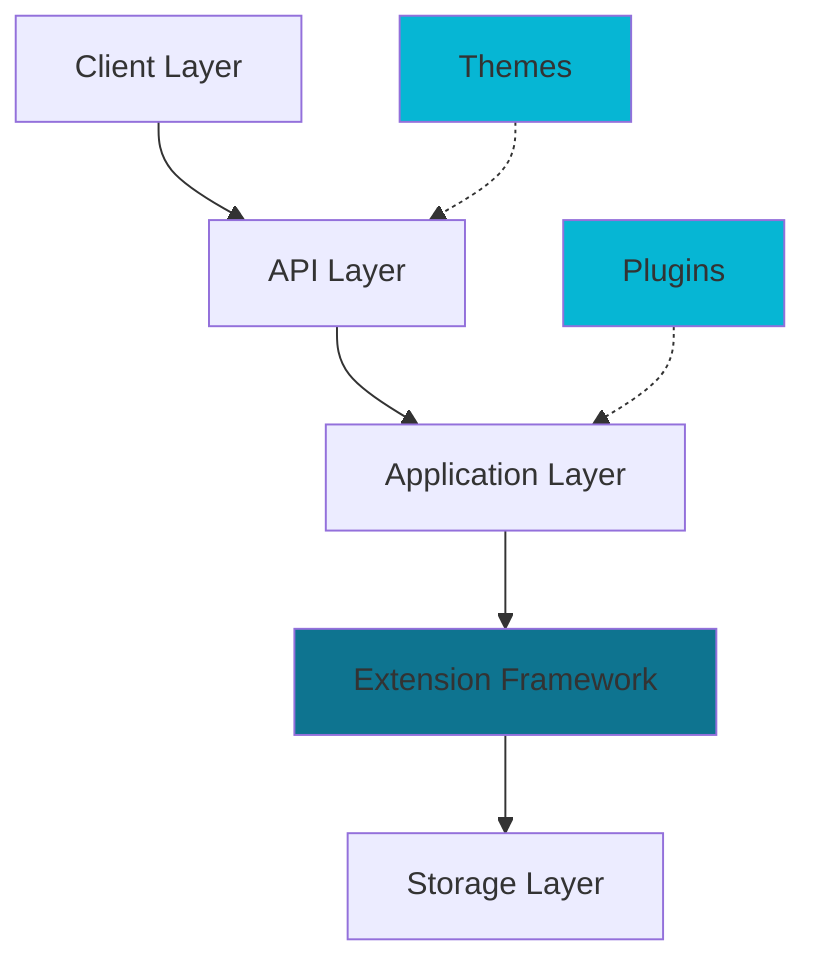
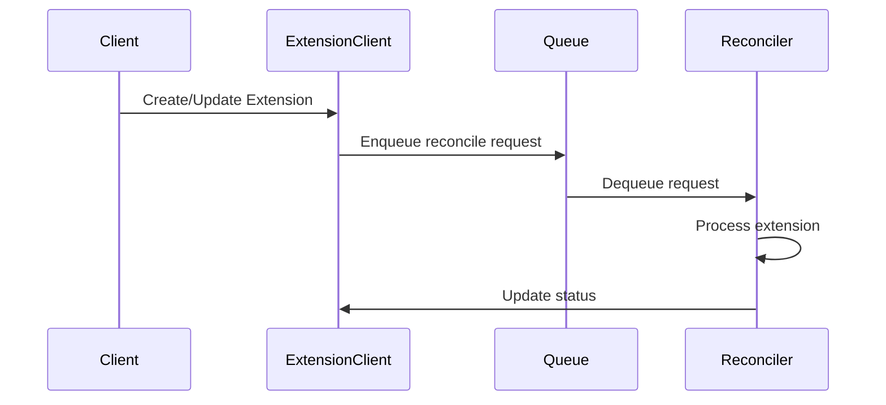

Halo is built on a modern, extensible architecture that combines Spring Boot with a Kubernetes-style extension framework. This design enables powerful customization capabilities while maintaining system stability and performance.

## Architecture overview

Halo's architecture consists of several key layers that work together to provide a flexible content management system:

### Key components

**Extension framework**

At the core of Halo is a Kubernetes-inspired extension framework that provides declarative resource management. All data in Halo (posts, users, comments, etc.) are represented as extensions with a consistent structure.

**Plugin system**

Plugins extend Halo's functionality by adding new features, API endpoints, and custom business logic. They run in isolated contexts and can register their own extensions and controllers.

**Theme system**

Themes control the visual presentation of your content. They use template engines to render pages and can be customized with configuration options.

**Storage layer**

Halo persists extension data using a flexible storage abstraction that supports multiple backends.

## Design principles

Halo's architecture is guided by several core principles:

### Declarative configuration

You define what you want (the desired state) rather than how to achieve it. The system automatically reconciles the current state with your desired state.

<Info>
This approach is borrowed from Kubernetes and provides predictable, reproducible system behavior.
</Info>

### Extension-based model

Everything in Halo is an extension - from core resources like posts and pages to custom resources defined by plugins. This unified model simplifies development and provides consistent APIs.

### Controller pattern

Controllers watch for changes to extensions and reconcile them to their desired state. This reactive pattern enables automatic updates and self-healing behavior.

### Isolation and modularity

Plugins run in isolated contexts with their own Spring application contexts, preventing conflicts and enabling safe hot-reloading.

## Request lifecycle

Understanding how requests flow through Halo helps you work effectively with the system:

### Public API request

1. Client sends HTTP request to Halo
2. Spring Boot routes request to appropriate controller
3. Controller queries extensions using ExtensionClient
4. Theme template renders the response
5. Response returns to client

### Console API request

1. Authenticated user sends request
2. Security layer validates permissions
3. Controller performs CRUD operations on extensions
4. Changes trigger reconciliation by relevant controllers
5. System converges to desired state

### Extension reconciliation

<Tip>
Reconcilers are the workhorses of Halo. They implement business logic and keep your system in sync.
</Tip>

## Scalability considerations

Halo is designed to scale from single-instance deployments to distributed systems:

**Single instance**: Suitable for most blogs and small websites. All components run in one JVM process.

**Horizontal scaling**: Multiple Halo instances can share the same storage layer, enabling load distribution and high availability.

**Resource isolation**: Plugins and themes run in isolated contexts, preventing resource contention.

## Next steps

Now that you understand Halo's architecture, explore the specific systems:

<CardGroup cols={2}>
  <Card title="Extensions" icon="puzzle-piece" href="/concepts/extensions">
    Learn about the extension framework and GVK model
  </Card>
  <Card title="Plugins" icon="plug" href="/concepts/plugins">
    Discover how plugins extend Halo's functionality
  </Card>
  <Card title="Themes" icon="palette" href="/concepts/themes">
    Explore the theme system and templating
  </Card>
  <Card title="Developer Guide" icon="code" href="/developer/overview">
    Start building with Halo
  </Card>
</CardGroup>
