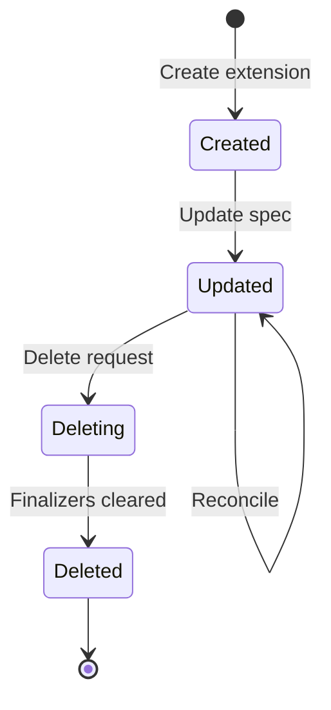

Extensions are the foundation of Halo's data model. Every resource in Halo - posts, users, comments, plugins, themes - is represented as an extension. This unified model provides consistency and powerful capabilities.

## What is an extension?

An extension is a structured data object that follows the Kubernetes resource model. Extensions have a predictable structure with metadata, specification, and status sections.

<Note>
If you're familiar with Kubernetes, Halo extensions work similarly to Kubernetes Custom Resources.
</Note>

## Extension structure

Every extension has four key components:

### API version and kind (GVK)

Every extension is identified by its GroupVersionKind (GVK):

```yaml
apiVersion: content.halo.run/v1alpha1
kind: Post
```

- **Group**: Organizes related resources (e.g., `content.halo.run`, `plugin.halo.run`)
- **Version**: API version, typically `v1alpha1` or `v1`
- **Kind**: Resource type (e.g., `Post`, `User`, `Plugin`)

<Info>
The GVK pattern enables API versioning and evolution without breaking existing clients.
</Info>

### Metadata

Metadata contains identifying information and system-managed fields:

```yaml
metadata:
  name: my-first-post
  labels:
    content.halo.run/published: "true"
    content.halo.run/owner: admin
  annotations:
    content.halo.run/stats: '{"visits": 100}'
  creationTimestamp: "2024-01-15T10:30:00Z"
  version: 5
```

**Key metadata fields:**

- **name**: Unique identifier for the extension (required)
- **labels**: Key-value pairs for filtering and selection
- **annotations**: Key-value pairs for storing arbitrary metadata
- **creationTimestamp**: When the extension was created (system-managed)
- **deletionTimestamp**: When deletion was requested (system-managed)
- **version**: Optimistic concurrency control version (system-managed)
- **finalizers**: Prevent deletion until cleanup is complete

### Spec (specification)

The spec defines the desired state of the resource. This is where you declare what you want:

```yaml
spec:
  title: "Getting Started with Halo"
  slug: getting-started
  publish: true
  allowComment: true
  visible: PUBLIC
  owner: admin
```

<Tip>
The spec should be immutable once created, or changes should trigger reconciliation.
</Tip>

### Status

The status reflects the current observed state. Controllers update the status to report what's actually happening:

```yaml
status:
  phase: PUBLISHED
  permalink: "/posts/getting-started"
  conditions:
    - type: Ready
      status: True
      lastTransitionTime: "2024-01-15T10:35:00Z"
  observedVersion: 5
```

<Note>
Users modify spec; controllers modify status. This separation enables clear responsibility boundaries.
</Note>

## Working with extensions in code

Halo provides Java interfaces for working with extensions:

### Defining an extension

Extensions implement the `Extension` interface and use the `@GVK` annotation:

```java
import run.halo.app.extension.AbstractExtension;
import run.halo.app.extension.GVK;

@GVK(
    group = "content.halo.run",
    version = "v1alpha1",
    kind = "Post",
    plural = "posts",
    singular = "post"
)
public class Post extends AbstractExtension {
    private PostSpec spec;
    private PostStatus status;
    
    // Getters and setters...
}
```

### Using ExtensionClient

The `ExtensionClient` provides CRUD operations for extensions:

```java
// Fetch an extension
Optional<Post> post = client.fetch(Post.class, "my-post");

// List extensions with filtering
List<Post> publishedPosts = client.listAll(
    Post.class,
    ListOptions.builder()
        .labelSelector("content.halo.run/published=true")
        .build(),
    Sort.by("metadata.creationTimestamp").descending()
);

// Create an extension
Post newPost = new Post();
// ... set properties ...
client.create(newPost);

// Update an extension
post.ifPresent(p -> {
    p.getSpec().setTitle("Updated Title");
    client.update(p);
});
```

## Labels and selectors

Labels enable powerful querying capabilities:

### Label selectors

Filter extensions using label selectors:

```java
// Equality-based selector
ListOptions.builder()
    .labelSelector("content.halo.run/published=true")
    .build()

// Set-based selector
ListOptions.builder()
    .labelSelector("content.halo.run/visible in (PUBLIC,INTERNAL)")
    .build()
```

### Field selectors

Filter by specific fields:

```java
ListOptions.builder()
    .fieldSelector("spec.owner=admin")
    .build()
```

## Indexing and querying

Halo provides an indexing system for efficient queries:

```java
// Define an index
IndexSpec indexSpec = new IndexSpecBuilder()
    .withName("author")
    .withIndexFunc(post -> List.of(post.getSpec().getOwner()))
    .build();

// Query using the index
Query query = QueryFactory.equal("spec.owner", "admin")
    .and(QueryFactory.equal("spec.published", "true"));
```

<Info>
Indexing dramatically improves query performance for large datasets.
</Info>

## Controllers and reconciliation

Controllers watch extensions and reconcile them to their desired state:

```java
public class PostReconciler implements Reconciler<Request> {
    @Override
    public Result reconcile(Request request) {
        // Fetch the post
        return client.fetch(Post.class, request.name())
            .map(post -> {
                // Reconcile logic
                updatePostStatus(post);
                generatePermalink(post);
                return Result.doNotRetry();
            })
            .orElse(Result.doNotRetry());
    }
}
```

<Tip>
Controllers enable reactive, event-driven architectures that automatically respond to changes.
</Tip>

## Extension lifecycle

Extensions move through a defined lifecycle:



### Finalizers and deletion

Finalizers prevent deletion until cleanup is complete:

```java
// Add finalizer
MetadataOperator metadata = post.getMetadata();
Set<String> finalizers = metadata.getFinalizers();
if (finalizers == null) {
    finalizers = new HashSet<>();
    metadata.setFinalizers(finalizers);
}
finalizers.add("my-finalizer");
client.update(post);

// In reconciler, check for deletion and remove finalizer
if (post.getMetadata().getDeletionTimestamp() != null) {
    // Perform cleanup
    cleanup(post);
    
    // Remove finalizer
    post.getMetadata().getFinalizers().remove("my-finalizer");
    client.update(post);
}
```

## Core extensions

Halo includes several built-in extensions:

<AccordionGroup>
  <Accordion title="Content extensions">
    - **Post**: Blog posts with categories and tags
    - **SinglePage**: Standalone pages
    - **Comment**: Comments on posts and pages
    - **Category**: Content categories
    - **Tag**: Content tags
  </Accordion>
  
  <Accordion title="System extensions">
    - **User**: User accounts
    - **Role**: Permission roles
    - **Plugin**: Installed plugins
    - **Theme**: Installed themes
    - **Setting**: Configuration settings
    - **ConfigMap**: Configuration data
    - **Secret**: Sensitive data
  </Accordion>
</AccordionGroup>

## Best practices

Follow these guidelines when working with extensions:

**Use meaningful names**: Extension names should be descriptive and URL-safe.

**Leverage labels**: Use labels for categorization and filtering, not for storing large amounts of data.

**Keep specs immutable**: Avoid frequent spec changes. Use status for dynamic data.

**Implement reconcilers**: For complex logic, use controllers to maintain consistency.

**Handle errors gracefully**: Controllers may be retried, so ensure idempotency.

## Next steps

<CardGroup cols={2}>
  <Card title="Plugins" icon="plug" href="/concepts/plugins">
    Learn how plugins use extensions
  </Card>
  <Card title="Custom models" icon="cube" href="/developer/extension/custom-models">
    Create your own extension types
  </Card>
  <Card title="Reconcilers" icon="arrows-rotate" href="/developer/extension/reconciler">
    Build controllers to manage extensions
  </Card>
  <Card title="Indexing" icon="magnifying-glass" href="/developer/extension/indexing">
    Optimize queries with indexing
  </Card>
</CardGroup>
