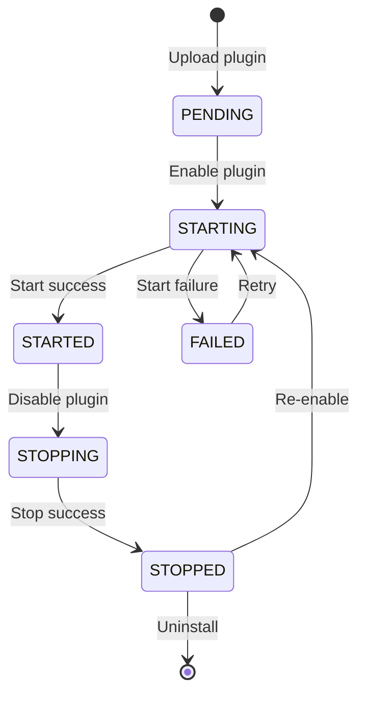

Plugins are self-contained modules that extend Halo's functionality. They can add new features, customize behavior, integrate external services, and register custom extensions - all without modifying the core system.

## What are plugins?

A plugin is a JAR file that contains:

- Custom extensions and controllers
- API endpoints and services
- Configuration and settings
- Static assets (JavaScript, CSS)
- Event listeners and hooks

<Info>
Halo uses [PF4J](https://pf4j.org/) as the foundation for its plugin system, providing hot-reloading and isolation.
</Info>

## Plugin structure

Every plugin follows a standard structure:

```
my-plugin/
├── src/main/
│   ├── java/
│   │   └── com/example/myplugin/
│   │       ├── MyPlugin.java          # Main plugin class
│   │       ├── controllers/           # API endpoints
│   │       ├── reconcilers/           # Extension controllers
│   │       └── extensions/            # Custom extensions
│   └── resources/
│       ├── plugin.yaml                # Plugin metadata
│       ├── extensions/                # Extension definitions
│       │   ├── settings.yaml
│       │   └── my-extension.yaml
│       └── console/                   # UI assets
│           ├── main.js
│           └── style.css
└── gradle.properties                  # Build configuration
```

## Plugin metadata

Every plugin has a `plugin.yaml` manifest that declares its metadata:

```yaml
apiVersion: plugin.halo.run/v1alpha1
kind: Plugin
metadata:
  name: my-awesome-plugin
spec:
  version: 1.0.0
  requires: ">=2.0.0"
  author:
    name: John Doe
    website: https://example.com
  displayName: "My Awesome Plugin"
  description: "Add amazing features to your Halo site"
  homepage: https://github.com/example/my-plugin
  license:
    - name: MIT
  settingName: my-plugin-settings
  configMapName: my-plugin-config
```

<Tip>
The `requires` field uses semantic versioning to specify compatible Halo versions.
</Tip>

## Plugin lifecycle

Plugins move through several states during their lifecycle:



### Lifecycle phases

**PENDING**: Plugin uploaded but not yet processed.

**STARTING**: Plugin is being initialized and dependencies are being resolved.

**STARTED**: Plugin is running and fully functional.

**STOPPING**: Plugin is being shut down gracefully.

**STOPPED**: Plugin is disabled but still installed.

**FAILED**: Plugin encountered an error during startup or operation.

## Creating a plugin

Plugins extend the `BasePlugin` class:

```java
import run.halo.app.plugin.BasePlugin;
import run.halo.app.plugin.PluginContext;
import org.springframework.stereotype.Component;

public class MyPlugin extends BasePlugin {
    
    public MyPlugin(PluginContext context) {
        super(context);
    }
    
    @Override
    public void start() {
        System.out.println("Plugin started: " + getContext().getName());
    }
    
    @Override
    public void stop() {
        System.out.println("Plugin stopped: " + getContext().getName());
    }
}
```

### Plugin context

The `PluginContext` provides access to plugin information:

```java
PluginContext context = getContext();

// Get plugin metadata
String name = context.getName();
String version = context.getVersion();
RuntimeMode mode = context.getRuntimeMode();

// Access configuration
String configMapName = context.getConfigMapName();
```

## Spring integration

Plugins have their own Spring application context, enabling dependency injection:

```java
import org.springframework.stereotype.Component;

@Component
public class MyService {
    
    private final ReactiveExtensionClient client;
    
    public MyService(ReactiveExtensionClient client) {
        this.client = client;
    }
    
    public Mono<Post> getPost(String name) {
        return client.fetch(Post.class, name);
    }
}
```

<Note>
Plugins can inject Halo's core services like `ExtensionClient`, `SchemeManager`, and more.
</Note>

## Registering extensions

Plugins can define custom extensions in YAML files:

```yaml
# src/main/resources/extensions/bookmark.yaml
apiVersion: example.com/v1alpha1
kind: Bookmark
metadata:
  name: bookmark-crd
spec:
  names:
    kind: Bookmark
    plural: bookmarks
    singular: bookmark
  schema:
    type: object
    properties:
      spec:
        type: object
        properties:
          title:
            type: string
          url:
            type: string
          description:
            type: string
```

Then create the Java class:

```java
import run.halo.app.extension.AbstractExtension;
import run.halo.app.extension.GVK;

@GVK(
    group = "example.com",
    version = "v1alpha1",
    kind = "Bookmark",
    plural = "bookmarks",
    singular = "bookmark"
)
public class Bookmark extends AbstractExtension {
    private BookmarkSpec spec;
    
    @Data
    public static class BookmarkSpec {
        private String title;
        private String url;
        private String description;
    }
}
```

## Adding API endpoints

Plugins can expose custom REST APIs:

```java
import org.springframework.web.bind.annotation.*;
import reactor.core.publisher.Mono;

@RestController
@RequestMapping("/apis/example.com/v1alpha1/bookmarks")
public class BookmarkController {
    
    private final ReactiveExtensionClient client;
    
    public BookmarkController(ReactiveExtensionClient client) {
        this.client = client;
    }
    
    @GetMapping("/{name}")
    public Mono<Bookmark> getBookmark(@PathVariable String name) {
        return client.fetch(Bookmark.class, name);
    }
    
    @PostMapping
    public Mono<Bookmark> createBookmark(@RequestBody Bookmark bookmark) {
        return client.create(bookmark);
    }
}
```

<Tip>
Use the `/apis/<group>/<version>` pattern for consistency with Halo's core APIs.
</Tip>

## Implementing reconcilers

Reconcilers watch extensions and maintain their desired state:

```java
import run.halo.app.extension.controller.*;
import reactor.core.publisher.Mono;

@Component
public class BookmarkReconciler implements Reconciler<Request> {
    
    private final ReactiveExtensionClient client;
    
    public BookmarkReconciler(ReactiveExtensionClient client) {
        this.client = client;
    }
    
    @Override
    public Result reconcile(Request request) {
        return client.fetch(Bookmark.class, request.name())
            .flatMap(bookmark -> {
                // Validate bookmark
                if (!isValidUrl(bookmark.getSpec().getUrl())) {
                    bookmark.setStatus(new Status("Invalid URL"));
                    return client.update(bookmark);
                }
                return Mono.just(bookmark);
            })
            .map(bookmark -> Result.doNotRetry())
            .defaultIfEmpty(Result.doNotRetry())
            .block();
    }
    
    @Override
    public Controller setupWith(ControllerBuilder builder) {
        return builder
            .extension(new Bookmark())
            .build();
    }
}
```

## Plugin settings

Plugins can define settings for user configuration:

```yaml
# src/main/resources/extensions/settings.yaml
apiVersion: v1alpha1
kind: Setting
metadata:
  name: my-plugin-settings
spec:
  forms:
    - group: basic
      label: Basic Settings
      formSchema:
        - $formkit: text
          name: apiKey
          label: API Key
          validation: required
        - $formkit: number
          name: maxItems
          label: Maximum Items
          value: 10
```

Access settings in your plugin:

```java
import run.halo.app.plugin.SettingFetcher;

@Component
public class MyService {
    
    private final SettingFetcher settingFetcher;
    
    public MyService(SettingFetcher settingFetcher) {
        this.settingFetcher = settingFetcher;
    }
    
    public String getApiKey() {
        return settingFetcher.fetch("basic", "apiKey")
            .orElse("");
    }
}
```

## Handling events

Plugins can listen to system events:

```java
import org.springframework.context.event.EventListener;
import org.springframework.stereotype.Component;
import run.halo.app.plugin.event.PluginStartedEvent;

@Component
public class EventHandler {
    
    @EventListener(PluginStartedEvent.class)
    public void onPluginStarted(PluginStartedEvent event) {
        System.out.println("Plugin started: " + event.getPluginName());
    }
}
```

## Console integration

Plugins can extend the admin console UI:

```javascript
// src/main/resources/console/main.js
import { definePlugin } from '@halo-dev/console-shared';

export default definePlugin({
  name: 'MyPlugin',
  components: {},
  routes: [
    {
      path: '/my-plugin',
      name: 'MyPluginHome',
      component: () => import('./views/Home.vue'),
      meta: {
        title: 'My Plugin',
        menu: {
          name: 'My Plugin',
          icon: 'IconPlug',
        },
      },
    },
  ],
});
```

## Plugin dependencies

Plugins can depend on other plugins:

```yaml
spec:
  pluginDependencies:
    "plugin.halo.run/another-plugin": ">=1.0.0"
```

<Note>
Halo resolves dependencies automatically and ensures plugins load in the correct order.
</Note>

## Best practices

Follow these guidelines for plugin development:

**Use semantic versioning**: Follow semver for version numbers.

**Handle errors gracefully**: Don't crash the entire system on plugin errors.

**Clean up resources**: Release resources in the `stop()` method.

**Namespace your APIs**: Use unique groups for your extensions and endpoints.

**Document your plugin**: Provide clear documentation for users and developers.

**Test thoroughly**: Test loading, unloading, and upgrading scenarios.

## Next steps

<CardGroup cols={2}>
  <Card title="Plugin basics" icon="rocket" href="/developer/plugin/basics">
    Start building your first plugin
  </Card>
  <Card title="Plugin structure" icon="folder-tree" href="/developer/plugin/structure">
    Learn about plugin project structure
  </Card>
  <Card title="API extension" icon="code" href="/developer/plugin/api-extension">
    Add custom API endpoints
  </Card>
  <Card title="Configuration" icon="gear" href="/developer/plugin/configuration">
    Configure plugin settings
  </Card>
</CardGroup>
