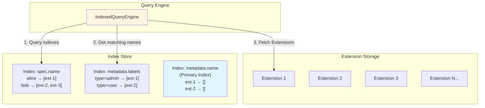
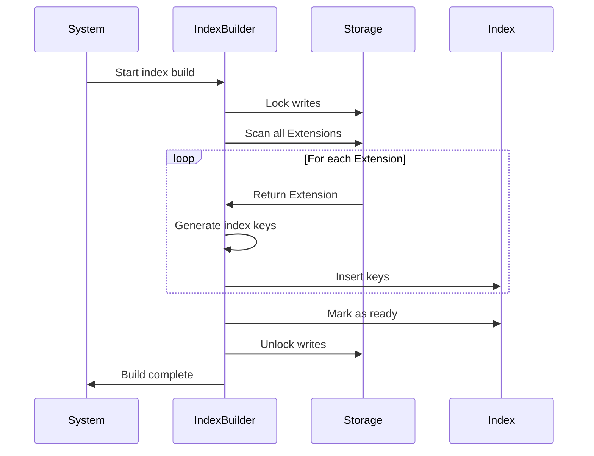

Halo's indexing system enables efficient querying of Extensions without loading all data into memory. By creating indexes on specific fields, you can perform fast lookups, filtering, and sorting operations.

## Why Indexing?

Without indexes, querying Extensions requires:
1. Loading all Extension data from storage
2. Filtering in memory
3. Sorting in memory

This approach doesn't scale well. With indexes:
1. Query uses indexes to find matching names
2. Only matching Extensions are loaded
3. Results are pre-sorted by index

<Info>
Indexes significantly improve query performance and reduce memory usage, especially with large datasets.
</Info>

## Index Architecture



## Creating Indexes

### Method 1: Using IndexSpecs (Recommended)

Register indexes programmatically using `IndexSpecs`:

```java
import org.springframework.stereotype.Component;
import run.halo.app.extension.index.IndexSpecRegistry;

@Component
public class BookIndexConfiguration {
    
    public BookIndexConfiguration(IndexSpecRegistry indexSpecRegistry) {
        var indexSpecs = indexSpecRegistry.indexFor(Book.class);
        
        // Single-value index (one value per Extension)
        indexSpecs.add(IndexSpecs.single(
            "spec.title",
            String.class
        )
        .indexFunc(book -> book.getSpec().getTitle())
        .build());
        
        // Multi-value index (multiple values per Extension)
        indexSpecs.add(IndexSpecs.multi(
            "spec.authors",
            String.class
        )
        .indexFunc(book -> {
            var authors = book.getSpec().getAuthors();
            return authors != null ? Set.copyOf(authors) : Set.of();
        })
        .build());
        
        // Index with ordering
        indexSpecs.add(IndexSpecs.single(
            "spec.publicationYear",
            Integer.class
        )
        .indexFunc(book -> book.getSpec().getPublicationYear())
        .build());
    }
}
```

### Method 2: Using Annotations (Deprecated)

<Warning>
The `@Index` and `@Indexes` annotations are deprecated. Use `IndexSpecs` instead for better type safety and flexibility.
</Warning>

Older code may use annotations:

```java
@Data
@Indexes({
    @Index(name = "spec.title", field = "spec.title"),
    @Index(name = "spec.publicationYear", field = "spec.publicationYear")
})
@GVK(group = "content.halo.run", version = "v1alpha1", 
     kind = "Book", plural = "books", singular = "book")
public class Book extends AbstractExtension {
    private BookSpec spec;
}
```

## Default Indexes

Every Extension automatically gets these indexes:

```java
// Primary index (unique)
"metadata.name" -> Extension name

// Common metadata indexes
"metadata.creationTimestamp" -> Creation time
"metadata.deletionTimestamp" -> Deletion time (for soft deletes)
"metadata.labels" -> All labels (multi-value)
```

You don't need to create these manually.

## Single vs Multi-Value Indexes

### Single-Value Index

Use when each Extension has **one value** for the field:

```java
// Each book has one title
indexSpecs.add(IndexSpecs.single(
    "spec.title",
    String.class
)
.indexFunc(book -> book.getSpec().getTitle())
.build());

// Each book has one ISBN
indexSpecs.add(IndexSpecs.single(
    "spec.isbn",
    String.class
)
.indexFunc(book -> book.getSpec().getIsbn())
.build());
```

### Multi-Value Index

Use when each Extension has **multiple values** for the field:

```java
// Each book can have multiple authors
indexSpecs.add(IndexSpecs.multi(
    "spec.authors",
    String.class
)
.indexFunc(book -> {
    var authors = book.getSpec().getAuthors();
    return authors != null ? Set.copyOf(authors) : Set.of();
})
.build());

// Each book can have multiple genres
indexSpecs.add(IndexSpecs.multi(
    "spec.genres",
    String.class
)
.indexFunc(book -> {
    var genres = book.getSpec().getGenres();
    return genres != null ? Set.copyOf(genres) : Set.of();
})
.build());
```

## Querying with Indexes

### Using ReactiveExtensionClient

The recommended way to query Extensions:

```java
import org.springframework.data.domain.Sort;
import run.halo.app.extension.ListOptions;
import run.halo.app.extension.PageRequest;
import run.halo.app.extension.index.query.Queries;

@Service
public class BookService {
    
    private final ReactiveExtensionClient client;
    
    public BookService(ReactiveExtensionClient client) {
        this.client = client;
    }
    
    // Query by single field
    public Flux<Book> findByAuthor(String author) {
        var listOptions = ListOptions.builder()
            .fieldQuery(Queries.equal("spec.authors", author))
            .build();
        
        var sort = Sort.by("metadata.creationTimestamp").descending();
        
        return client.listAll(Book.class, listOptions, sort);
    }
    
    // Query with multiple conditions
    public Flux<Book> findPublishedBooksByGenre(String genre) {
        var listOptions = ListOptions.builder()
            .fieldQuery(
                Queries.equal("spec.genres", genre)
                    .and(Queries.equal("spec.status", "PUBLISHED"))
            )
            .build();
        
        var sort = Sort.by("spec.publicationYear").descending();
        
        return client.listAll(Book.class, listOptions, sort);
    }
    
    // Paginated query
    public Mono<ListResult<Book>> listBooks(int page, int size) {
        var listOptions = new ListOptions();
        var pageRequest = PageRequest.of(page, size, 
            Sort.by("spec.title").ascending());
        
        return client.listBy(Book.class, listOptions, pageRequest);
    }
}
```

### Building ListOptions

`ListOptions` combines field queries and label selectors:

```java
// Simple field query
var options1 = ListOptions.builder()
    .fieldQuery(Queries.equal("spec.title", "The Great Gatsby"))
    .build();

// Label selector only
var options2 = ListOptions.builder()
    .labelSelector()
        .eq("type", "novel")
        .exists("featured")
    .end()
    .build();

// Combined field and label queries
var options3 = ListOptions.builder()
    .fieldQuery(Queries.greaterThan("spec.publicationYear", "2000"))
    .labelSelector()
        .eq("category", "fiction")
    .end()
    .build();

// Complex AND/OR queries
var options4 = ListOptions.builder()
    .fieldQuery(
        Queries.equal("spec.status", "PUBLISHED")
            .and(
                Queries.greaterThan("spec.publicationYear", "2020")
                    .or(Queries.equal("spec.featured", "true"))
            )
    )
    .build();
```

## Query Operations

The `Queries` utility provides various query operations:

### Equality Queries

```java
// Equal
Queries.equal("spec.title", "1984")

// Not equal
Queries.notEqual("spec.status", "ARCHIVED")

// In list
Queries.in("spec.language", Set.of("en", "es", "fr"))

// Not in list
Queries.notIn("spec.status", Set.of("DRAFT", "ARCHIVED"))
```

### Comparison Queries

```java
// Greater than
Queries.greaterThan("spec.publicationYear", "2000")

// Greater than or equal
Queries.greaterThan("spec.publicationYear", "2000", true)

// Less than
Queries.lessThan("spec.pages", "500")

// Less than or equal
Queries.lessThan("spec.pages", "500", true)

// Between (inclusive)
Queries.between("spec.publicationYear", "2000", true, "2020", true)

// Between (exclusive)
Queries.between("spec.publicationYear", "2000", false, "2020", false)
```

### String Queries

```java
// Starts with
Queries.startsWith("spec.title", "The ")

// Ends with
Queries.endsWith("spec.title", " Guide")

// Contains
Queries.contains("spec.title", "Java")

// Not contains
Queries.notContains("spec.title", "deprecated")
```

### Null Queries

```java
// Is null
Queries.isNull("spec.subtitle")

// Is not null (exists)
Queries.isNotNull("spec.featuredImage")
```

### Logical Operators

```java
// AND
Queries.equal("spec.status", "PUBLISHED")
    .and(Queries.greaterThan("spec.publicationYear", "2020"))

// OR
Queries.equal("spec.language", "en")
    .or(Queries.equal("spec.language", "es"))

// NOT
Queries.equal("spec.status", "DRAFT").not()

// Complex combinations
Queries.equal("spec.status", "PUBLISHED")
    .and(
        Queries.in("spec.language", Set.of("en", "es"))
            .or(Queries.equal("spec.featured", "true"))
    )
```

## Query Examples

### Example 1: Find Books by Multiple Criteria

```java
public Flux<Book> findRecentEnglishNovels() {
    var listOptions = ListOptions.builder()
        .fieldQuery(
            Queries.equal("spec.status", "PUBLISHED")
                .and(Queries.equal("spec.language", "en"))
                .and(Queries.greaterThan("spec.publicationYear", "2020"))
        )
        .labelSelector()
            .eq("category", "novel")
        .end()
        .build();
    
    var sort = Sort.by("spec.publicationYear").descending();
    
    return client.listAll(Book.class, listOptions, sort);
}
```

### Example 2: Search with Pagination

```java
public Mono<ListResult<Book>> searchBooks(
    String searchTerm, 
    int page, 
    int size
) {
    var listOptions = ListOptions.builder()
        .fieldQuery(
            Queries.contains("spec.title", searchTerm)
                .or(Queries.contains("spec.description", searchTerm))
        )
        .build();
    
    var pageRequest = PageRequest.of(
        page, 
        size,
        Sort.by("spec.title").ascending()
    );
    
    return client.listBy(Book.class, listOptions, pageRequest);
}
```

### Example 3: Count Extensions

```java
public Mono<Long> countPublishedBooks() {
    var listOptions = ListOptions.builder()
        .fieldQuery(Queries.equal("spec.status", "PUBLISHED"))
        .build();
    
    return client.countBy(Book.class, listOptions);
}
```

### Example 4: Get Top N Results

```java
public Flux<String> getTopRatedBookNames(int limit) {
    var listOptions = ListOptions.builder()
        .fieldQuery(Queries.isNotNull("status.rating"))
        .build();
    
    var sort = Sort.by("status.rating").descending();
    
    return client.listTopNames(Book.class, listOptions, sort, limit);
}
```

## Index Performance

### Index Structure

Indexes are stored as sorted key-value pairs:

```javascript
{
  "metadata.name": {
    "book-1": [],
    "book-2": [],
    "book-3": []
  },
  "spec.title": {
    "1984": ["book-1"],
    "Animal Farm": ["book-2"],
    "Brave New World": ["book-3"]
  },
  "spec.authors": {
    "George Orwell": ["book-1", "book-2"],
    "Aldous Huxley": ["book-3"]
  }
}
```

### Index Building Process



### Optimization Tips

1. **Index only what you query**: Don't create indexes for fields you never filter or sort by
2. **Use appropriate index types**: Single-value for one-to-one, multi-value for one-to-many
3. **Consider cardinality**: High-cardinality fields (many unique values) benefit more from indexes
4. **Avoid over-indexing**: Each index adds memory overhead and slows down writes

<Tip>
Start with queries on default indexes (metadata.name, labels, creationTimestamp). Only add custom indexes when you identify performance bottlenecks.
</Tip>

## Best Practices

### 1. Index Fields You Query

```java
// If you frequently query by author
indexSpecs.add(IndexSpecs.multi("spec.authors", String.class)
    .indexFunc(book -> Set.copyOf(book.getSpec().getAuthors()))
    .build());

// If you frequently query by publication year
indexSpecs.add(IndexSpecs.single("spec.publicationYear", Integer.class)
    .indexFunc(book -> book.getSpec().getPublicationYear())
    .build());
```

### 2. Use Labels for Common Filters

```java
// Instead of indexing spec.category, use labels
var book = new Book();
book.getMetadata().setLabels(Map.of(
    "category", "fiction",
    "featured", "true"
));

// Query using built-in label index
var options = ListOptions.builder()
    .labelSelector()
        .eq("category", "fiction")
        .eq("featured", "true")
    .end()
    .build();
```

### 3. Handle Null Values

```java
// Always handle null in index functions
indexSpecs.add(IndexSpecs.multi("spec.tags", String.class)
    .indexFunc(book -> {
        var tags = book.getSpec().getTags();
        return tags != null ? Set.copyOf(tags) : Set.of();
    })
    .build());
```

### 4. Use Efficient Data Types

```java
// Good: Use appropriate types
indexSpecs.add(IndexSpecs.single("spec.publicationYear", Integer.class)
    .indexFunc(book -> book.getSpec().getPublicationYear())
    .build());

// Bad: Converting everything to String loses type safety
indexSpecs.add(IndexSpecs.single("spec.publicationYear", String.class)
    .indexFunc(book -> String.valueOf(book.getSpec().getPublicationYear()))
    .build());
```

## Troubleshooting

### Query Returns No Results

1. Check if the index exists for the field
2. Verify the field path is correct
3. Ensure index has been built (`ready: true`)
4. Check query value type matches index type

### Slow Queries

1. Add indexes for queried fields
2. Use `listTopNames` instead of loading all Extensions
3. Add pagination to limit results
4. Consider using labels instead of custom indexes

### High Memory Usage

1. Remove unused indexes
2. Consider using more specific queries to reduce result sets
3. Use pagination for large result sets

## Next Steps

- [Writing Reconcilers](/developer/extension/reconciler)
- [Extension System Overview](/developer/extension/overview)
- [Creating Custom Models](/developer/extension/custom-models)
