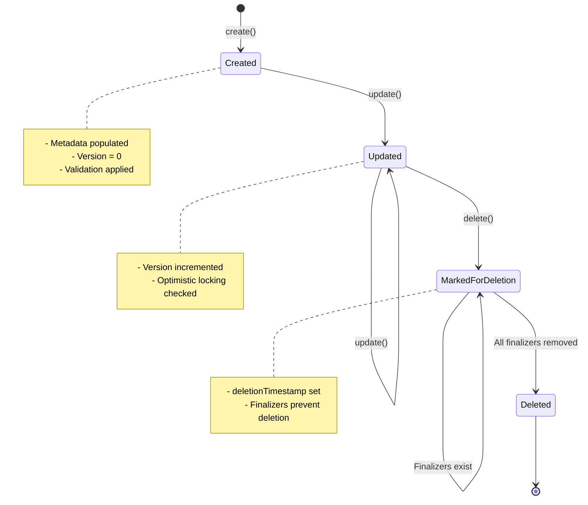

The Extension system is the core architectural pattern in Halo CMS that enables flexible, Kubernetes-inspired data modeling and persistence. Extensions allow developers to define custom resource types that are automatically managed by the system.

## What is an Extension?

An Extension is a structured data type that represents a resource in Halo. Similar to Kubernetes Custom Resources, Extensions provide:

- **Schema-based data modeling** with automatic validation
- **Metadata management** including labels, annotations, and versioning
- **CRUD operations** through a unified client interface
- **Watch and event notifications** for reactive programming
- **Indexing and querying** for efficient data retrieval

## Core Concepts

### Extension Interface

All custom types must implement the `Extension` interface:

```java
public interface Extension extends ExtensionOperator, Comparable<Extension> {
    @Override
    default int compareTo(Extension another) {
        if (another == null || another.getMetadata() == null) {
            return 1;
        }
        if (getMetadata() == null) {
            return -1;
        }
        return Objects.compare(getMetadata().getName(), 
            another.getMetadata().getName(),
            Comparator.naturalOrder());
    }
}
```

For convenience, you typically extend `AbstractExtension` which provides basic structure:

```java
@Data
public abstract class AbstractExtension implements Extension {
    private String apiVersion;
    private String kind;
    private MetadataOperator metadata;
}
```

### Group, Version, Kind (GVK)

Every Extension must be annotated with `@GVK` to define its identity:

```java
@GVK(
    group = "plugin.halo.run",
    version = "v1alpha1",
    kind = "Plugin",
    plural = "plugins",
    singular = "plugin"
)
public class Plugin extends AbstractExtension {
    private PluginSpec spec;
    private PluginStatus status;
}
```

**GVK Components:**

- **group**: API group name (e.g., `plugin.halo.run`, `content.halo.run`)
- **version**: API version (e.g., `v1alpha1`, `v1beta1`, `v1`)
- **kind**: Resource type name (singular, CamelCase)
- **plural**: Plural form for REST endpoints
- **singular**: Singular form for display

<Info>
The combination of group, version, and kind must be globally unique within your Halo instance.
</Info>

### Metadata

Every Extension has metadata that provides common fields:

```java
@Data
public class Metadata implements MetadataOperator {
    private String name;                    // Unique identifier
    private String generateName;            // Auto-generate name prefix
    private Map<String, String> labels;     // Key-value labels for selection
    private Map<String, String> annotations; // Key-value annotations for metadata
    private Long version;                   // Optimistic locking version
    private Instant creationTimestamp;      // Creation time
    private Instant deletionTimestamp;      // Deletion time (soft delete)
    private Set<String> finalizers;         // Prevent deletion until cleared
}
```

**Key Metadata Features:**

- **name**: Globally unique identifier for the resource
- **labels**: Used for querying and filtering (indexed by default)
- **annotations**: Store additional non-identifying metadata
- **version**: Optimistic locking to prevent concurrent update conflicts
- **finalizers**: Enable cleanup logic before deletion

### Scheme

The `Scheme` represents the complete definition of an Extension type:

```java
public record Scheme(
    Class<? extends Extension> type,
    GroupVersionKind groupVersionKind,
    String plural,
    String singular,
    ObjectNode openApiSchema
) {
    public static Scheme buildFromType(Class<? extends Extension> type) {
        var gvk = getGvkFromType(type);
        // Generate OpenAPI schema from class
        var resolvedSchema = ModelConverters.getInstance()
            .readAllAsResolvedSchema(type);
        // ...
        return new Scheme(type, gvk, plural, singular, schema);
    }
}
```

Schemes are automatically registered and managed by the `SchemeManager`.

## Extension Lifecycle



## Working with Extensions

### Creating an Extension

```java
@Component
public class MyService {
    private final ReactiveExtensionClient client;

    public Mono<Plugin> createPlugin(Plugin plugin) {
        // Set metadata
        plugin.setMetadata(new Metadata());
        plugin.getMetadata().setName("my-plugin");
        
        // Create in database
        return client.create(plugin);
    }
}
```

### Updating an Extension

```java
public Mono<Plugin> updatePlugin(String name) {
    return client.fetch(Plugin.class, name)
        .flatMap(plugin -> {
            // Modify the plugin
            plugin.getSpec().setEnabled(true);
            
            // Update (version is checked automatically)
            return client.update(plugin);
        });
}
```

<Warning>
Always fetch the latest version before updating to avoid optimistic locking failures.
</Warning>

### Deleting an Extension

```java
public Mono<Plugin> deletePlugin(String name) {
    return client.fetch(Plugin.class, name)
        .flatMap(client::delete);
}
```

### Listing Extensions

```java
public Flux<Plugin> listPlugins() {
    return client.list(Plugin.class, 
        plugin -> true,  // predicate
        Comparators.compareCreationTimestamp(false)); // comparator
}
```

## Extension Patterns

### Spec-Status Pattern

Follow the Kubernetes pattern of separating desired state (spec) from observed state (status):

```java
@GVK(group = "example.halo.run", version = "v1alpha1", 
     kind = "MyResource", plural = "myresources", singular = "myresource")
public class MyResource extends AbstractExtension {
    private MyResourceSpec spec;     // Desired state (user input)
    private MyResourceStatus status; // Observed state (system output)
}

@Data
public class MyResourceSpec {
    private String desiredValue;
    private boolean enabled;
}

@Data
public class MyResourceStatus {
    private String currentValue;
    private Phase phase;
    private ConditionList conditions;
}
```

<Tip>
Never modify `status` in user-facing APIs. Status should only be updated by controllers/reconcilers.
</Tip>

### Finalizers

Use finalizers to perform cleanup before deletion:

```java
public Mono<Void> ensureFinalizer(Plugin plugin) {
    var finalizers = plugin.getMetadata().getFinalizers();
    if (finalizers == null) {
        finalizers = new HashSet<>();
        plugin.getMetadata().setFinalizers(finalizers);
    }
    
    if (!finalizers.contains("my-plugin.halo.run/cleanup")) {
        finalizers.add("my-plugin.halo.run/cleanup");
        return client.update(plugin).then();
    }
    return Mono.empty();
}

public Mono<Void> cleanup(Plugin plugin) {
    // Perform cleanup logic
    return doCleanup(plugin)
        .then(Mono.defer(() -> {
            // Remove finalizer
            plugin.getMetadata().getFinalizers()
                .remove("my-plugin.halo.run/cleanup");
            return client.update(plugin).then();
        }));
}
```

## Best Practices

1. **Use meaningful GVK names**: Group names should be reverse-DNS format (e.g., `plugin.halo.run`)
2. **Version your APIs**: Start with `v1alpha1`, progress to `v1beta1`, then `v1`
3. **Follow spec-status pattern**: Keep desired and observed state separate
4. **Add validation**: Use `@Schema` annotations to define constraints
5. **Document your fields**: Use Javadoc and schema descriptions
6. **Use labels wisely**: Index frequently queried fields as labels
7. **Handle optimistic locking**: Retry on version conflicts
8. **Clean up with finalizers**: Ensure resources are properly cleaned up

## Next Steps

- [Creating Custom Extension Models](/developer/extension/custom-models)
- [Indexing and Querying](/developer/extension/indexing)
- [Writing Reconcilers](/developer/extension/reconciler)
