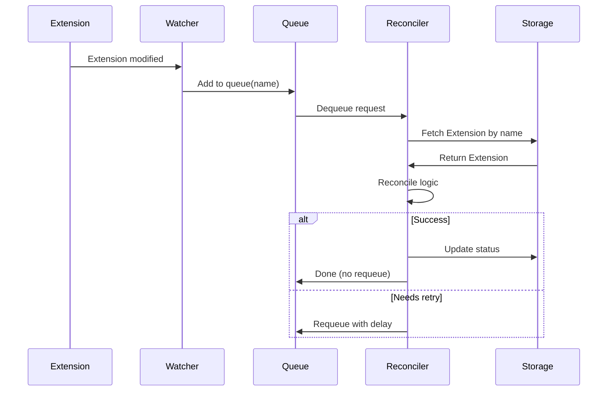

Reconcilers are the heart of Halo's control loop pattern. They watch for changes to Extensions and work to reconcile the actual state with the desired state, similar to Kubernetes controllers.

## What is a Reconciler?

A Reconciler is a component that:

1. **Watches** for Extension changes (create, update, delete)
2. **Receives** reconciliation requests with the Extension name
3. **Reconciles** by comparing desired state (spec) with actual state (status)
4. **Updates** the Extension or external resources to match desired state
5. **Requeues** if further reconciliation is needed



## Reconciler Interface

Every reconciler implements the `Reconciler` interface:

```java
package run.halo.app.extension.controller;

import java.time.Duration;

public interface Reconciler<R> {
    
    /**
     * Reconcile the request.
     */
    Result reconcile(R request);
    
    /**
     * Set up the controller.
     */
    Controller setupWith(ControllerBuilder builder);
    
    /**
     * Reconciliation request.
     */
    record Request(String name) {
    }
    
    /**
     * Reconciliation result.
     */
    record Result(boolean reEnqueue, Duration retryAfter) {
        
        public static Result doNotRetry() {
            return new Result(false, null);
        }
        
        public static Result requeue(Duration retryAfter) {
            return new Result(true, retryAfter);
        }
    }
}
```

## Creating a Basic Reconciler

Here's a simple reconciler for managing Book Extensions:

```java
import org.springframework.stereotype.Component;
import run.halo.app.extension.controller.*;
import run.halo.app.extension.ExtensionClient;
import java.time.Duration;

@Component
public class BookReconciler implements Reconciler<Reconciler.Request> {
    
    private final ExtensionClient client;
    
    public BookReconciler(ExtensionClient client) {
        this.client = client;
    }
    
    @Override
    public Result reconcile(Request request) {
        // 1. Fetch the Extension by name
        return client.fetch(Book.class, request.name())
            .map(book -> {
                // 2. Reconcile logic
                if (needsReconciliation(book)) {
                    reconcileBook(book);
                    // 3. Update the Extension
                    client.update(book);
                }
                // 4. Return result
                return Result.doNotRetry();
            })
            .orElse(Result.doNotRetry()); // Extension deleted
    }
    
    @Override
    public Controller setupWith(ControllerBuilder builder) {
        return builder
            .extension(new Book())
            .syncAllOnStart(true)
            .build();
    }
    
    private boolean needsReconciliation(Book book) {
        // Check if reconciliation is needed
        var spec = book.getSpec();
        var status = book.getStatus();
        
        return !spec.getStatus().name().equals(status.getPhase().name());
    }
    
    private void reconcileBook(Book book) {
        var spec = book.getSpec();
        var status = book.getStatus();
        
        // Update status based on spec
        if (spec.getStatus() == Book.BookSpec.Status.PUBLISHED) {
            status.setPhase(Book.BookStatus.Phase.PUBLISHED);
            if (status.getPublishedAt() == null) {
                status.setPublishedAt(Instant.now());
            }
        } else if (spec.getStatus() == Book.BookSpec.Status.DRAFT) {
            status.setPhase(Book.BookStatus.Phase.PENDING);
        }
        
        status.setLastModifiedAt(Instant.now());
    }
}
```

## Controller Configuration

The `ControllerBuilder` provides various configuration options:

```java
@Override
public Controller setupWith(ControllerBuilder builder) {
    return builder
        // The Extension type to watch
        .extension(new Book())
        
        // Reconcile all Extensions on startup
        .syncAllOnStart(true)
        
        // Only reconcile Extensions matching these conditions
        .syncAllListOptions(
            ListOptions.builder()
                .labelSelector()
                    .eq("managed-by", "book-controller")
                .end()
                .build()
        )
        
        // Minimum delay between retries
        .minDelay(Duration.ofMillis(100))
        
        // Maximum delay between retries
        .maxDelay(Duration.ofMinutes(5))
        
        // Number of worker threads
        .workerCount(4)
        
        // Custom matchers for different events
        .onAddMatcher(extension -> {
            // Only reconcile when labels match
            var labels = extension.getMetadata().getLabels();
            return labels != null && "true".equals(labels.get("auto-process"));
        })
        
        .onUpdateMatcher(DefaultExtensionMatcher.builder(client, Book.GVK)
            .fieldSelector(FieldSelector.of(
                Queries.equal("spec.status", "PUBLISHED")
            ))
            .build())
        
        .build();
}
```

## Reactive Reconciler

For async operations, use `ReactiveExtensionClient`:

```java
import reactor.core.publisher.Mono;
import run.halo.app.extension.ReactiveExtensionClient;

@Component
public class BookReconciler implements Reconciler<Reconciler.Request> {
    
    private final ReactiveExtensionClient client;
    private final ExternalApiClient apiClient;
    
    public BookReconciler(
        ReactiveExtensionClient client,
        ExternalApiClient apiClient
    ) {
        this.client = client;
        this.apiClient = apiClient;
    }
    
    @Override
    public Result reconcile(Request request) {
        client.fetch(Book.class, request.name())
            .flatMap(this::reconcileBook)
            .block(); // Block in reconciler
        
        return Result.doNotRetry();
    }
    
    private Mono<Book> reconcileBook(Book book) {
        return Mono.just(book)
            .flatMap(this::syncToExternalApi)
            .flatMap(this::updateStatus)
            .flatMap(client::update)
            .onErrorResume(error -> {
                // Handle errors
                return updateErrorStatus(book, error)
                    .flatMap(client::update);
            });
    }
    
    private Mono<Book> syncToExternalApi(Book book) {
        if (book.getSpec().getStatus() == Book.BookSpec.Status.PUBLISHED) {
            return apiClient.publishBook(book)
                .thenReturn(book);
        }
        return Mono.just(book);
    }
    
    private Mono<Book> updateStatus(Book book) {
        return Mono.fromCallable(() -> {
            var status = book.getStatus();
            status.setPhase(Book.BookStatus.Phase.READY);
            status.setLastModifiedAt(Instant.now());
            return book;
        });
    }
    
    @Override
    public Controller setupWith(ControllerBuilder builder) {
        return builder
            .extension(new Book())
            .build();
    }
}
```

## Reconciliation Patterns

### 1. Status Updates

Update status to reflect current state:

```java
private void reconcileStatus(Book book) {
    var spec = book.getSpec();
    var status = book.getStatus();
    
    // Reflect spec state in status
    if (spec.getStatus() == Book.BookSpec.Status.PUBLISHED) {
        status.setPhase(Book.BookStatus.Phase.PUBLISHED);
        if (status.getPublishedAt() == null) {
            status.setPublishedAt(Instant.now());
        }
    }
    
    // Update timestamps
    status.setLastModifiedAt(Instant.now());
}
```

### 2. External Resource Management

Create or update external resources:

```java
private Result reconcileExternalResource(Book book) {
    try {
        // Check if external resource exists
        var externalId = book.getStatus().getExternalId();
        
        if (externalId == null) {
            // Create external resource
            var created = externalApi.createBook(book);
            book.getStatus().setExternalId(created.getId());
            client.update(book);
        } else {
            // Update external resource
            externalApi.updateBook(externalId, book);
        }
        
        book.getStatus().setPhase(Book.BookStatus.Phase.READY);
        client.update(book);
        
        return Result.doNotRetry();
    } catch (Exception e) {
        // Retry on failure
        return Result.requeue(Duration.ofSeconds(30));
    }
}
```

### 3. Finalizer Pattern

Clean up resources before deletion:

```java
private static final String FINALIZER = "book.halo.run/cleanup";

@Override
public Result reconcile(Request request) {
    return client.fetch(Book.class, request.name())
        .map(book -> {
            if (isDeleted(book)) {
                return handleDeletion(book);
            } else {
                return handleReconciliation(book);
            }
        })
        .orElse(Result.doNotRetry());
}

private boolean isDeleted(Book book) {
    return book.getMetadata().getDeletionTimestamp() != null;
}

private Result handleReconciliation(Book book) {
    // Ensure finalizer is present
    addFinalizerIfNeeded(book);
    
    // Normal reconciliation
    reconcileBook(book);
    client.update(book);
    
    return Result.doNotRetry();
}

private Result handleDeletion(Book book) {
    var finalizers = book.getMetadata().getFinalizers();
    
    if (finalizers != null && finalizers.contains(FINALIZER)) {
        // Perform cleanup
        try {
            cleanupExternalResources(book);
            
            // Remove finalizer
            finalizers.remove(FINALIZER);
            client.update(book);
        } catch (Exception e) {
            // Retry cleanup
            return Result.requeue(Duration.ofSeconds(10));
        }
    }
    
    return Result.doNotRetry();
}

private void addFinalizerIfNeeded(Book book) {
    var finalizers = book.getMetadata().getFinalizers();
    if (finalizers == null) {
        finalizers = new HashSet<>();
        book.getMetadata().setFinalizers(finalizers);
    }
    
    if (!finalizers.contains(FINALIZER)) {
        finalizers.add(FINALIZER);
        client.update(book);
    }
}

private void cleanupExternalResources(Book book) {
    var externalId = book.getStatus().getExternalId();
    if (externalId != null) {
        externalApi.deleteBook(externalId);
    }
}
```

### 4. Requeue Pattern

Requeue for periodic reconciliation:

```java
@Override
public Result reconcile(Request request) {
    return client.fetch(Book.class, request.name())
        .map(book -> {
            // Sync with external system
            syncStatus(book);
            
            // Always requeue to keep checking
            return Result.requeue(Duration.ofMinutes(5));
        })
        .orElse(Result.doNotRetry());
}

private void syncStatus(Book book) {
    var externalId = book.getStatus().getExternalId();
    if (externalId != null) {
        var externalData = externalApi.getBookStats(externalId);
        book.getStatus().setViewCount(externalData.getViews());
        book.getStatus().setRating(externalData.getRating());
        client.update(book);
    }
}
```

## Complete Example: Post Stats Updater

Here's a real-world example from Halo's codebase:

```java
import org.springframework.context.SmartLifecycle;
import org.springframework.stereotype.Component;
import run.halo.app.extension.controller.*;
import java.time.Duration;
import java.time.Instant;

@Component
public class PostStatsUpdater 
    implements Reconciler<PostStatsUpdater.StatsRequest>, SmartLifecycle {
    
    private volatile boolean running = false;
    private final ExtensionClient client;
    private final RequestQueue<StatsRequest> queue;
    private final Controller controller;
    
    public PostStatsUpdater(ExtensionClient client) {
        this.client = client;
        this.queue = new DefaultQueue<>(Instant::now);
        this.controller = this.setupWith(null);
    }
    
    @Override
    public Result reconcile(StatsRequest request) {
        client.fetch(Post.class, request.postName()).ifPresent(post -> {
            // Update stats in annotations
            var annotations = MetadataUtil.nullSafeAnnotations(post);
            annotations.put(Post.STATS_ANNO, JsonUtils.objectToJson(request.stats()));
            client.update(post);
        });
        return Result.doNotRetry();
    }
    
    @Override
    public Controller setupWith(ControllerBuilder builder) {
        return new DefaultController<>(
            this.getClass().getName(),
            this,
            queue,
            null,
            Duration.ofMillis(100),
            Duration.ofMinutes(10)
        );
    }
    
    // Lifecycle methods
    @Override
    public void start() {
        this.controller.start();
        this.running = true;
    }
    
    @Override
    public void stop() {
        this.running = false;
        this.controller.dispose();
    }
    
    @Override
    public boolean isRunning() {
        return this.running;
    }
    
    // Event handler to trigger reconciliation
    @EventListener(PostStatsChangedEvent.class)
    public void onStatsChanged(PostStatsChangedEvent event) {
        var stats = Stats.builder()
            .visit(event.getCounter().getVisit())
            .upvote(event.getCounter().getUpvote())
            .build();
        var request = new StatsRequest(event.getPostName(), stats);
        queue.addImmediately(request);
    }
    
    public record StatsRequest(String postName, Stats stats) {
    }
}
```

## Error Handling

### Optimistic Locking Failures

```java
@Override
public Result reconcile(Request request) {
    try {
        return client.fetch(Book.class, request.name())
            .map(book -> {
                reconcileBook(book);
                client.update(book);
                return Result.doNotRetry();
            })
            .orElse(Result.doNotRetry());
    } catch (OptimisticLockingFailureException e) {
        // Automatically retried by controller
        return Result.requeue(Duration.ofMillis(100));
    }
}
```

### Retry with Backoff

```java
@Override
public Result reconcile(Request request) {
    return client.fetch(Book.class, request.name())
        .map(book -> {
            try {
                processBook(book);
                return Result.doNotRetry();
            } catch (TemporaryException e) {
                // Retry with exponential backoff (handled by controller)
                return Result.requeue(null); // Use default backoff
            } catch (PermanentException e) {
                // Don't retry, update status with error
                book.getStatus().setPhase(Book.BookStatus.Phase.FAILED);
                client.update(book);
                return Result.doNotRetry();
            }
        })
        .orElse(Result.doNotRetry());
}
```

### RequeueException

```java
import run.halo.app.extension.controller.RequeueException;

@Override
public Result reconcile(Request request) {
    return client.fetch(Book.class, request.name())
        .map(book -> {
            if (!isReady(book)) {
                // Throw to requeue immediately
                throw new RequeueException(
                    Result.requeue(Duration.ofSeconds(5)),
                    "Book is not ready yet"
                );
            }
            
            processBook(book);
            return Result.doNotRetry();
        })
        .orElse(Result.doNotRetry());
}
```

## Best Practices

### 1. Keep Reconciliation Idempotent

```java
// Good: Idempotent - can be called multiple times safely
private void reconcileBook(Book book) {
    if (book.getSpec().getStatus() == Book.BookSpec.Status.PUBLISHED) {
        if (book.getStatus().getPublishedAt() == null) {
            book.getStatus().setPublishedAt(Instant.now());
        }
        book.getStatus().setPhase(Book.BookStatus.Phase.PUBLISHED);
    }
}

// Bad: Not idempotent - creates duplicate entries
private void reconcileBook(Book book) {
    externalApi.createBookEntry(book); // Creates new entry each time!
}
```

### 2. Don't Block for Too Long

```java
// Good: Quick reconciliation
@Override
public Result reconcile(Request request) {
    client.fetch(Book.class, request.name())
        .ifPresent(book -> {
            quickUpdate(book);
            client.update(book);
        });
    return Result.doNotRetry();
}

// Bad: Long-running operation blocks queue
@Override
public Result reconcile(Request request) {
    client.fetch(Book.class, request.name())
        .ifPresent(book -> {
            heavyProcessing(book); // Takes 30 seconds!
            client.update(book);
        });
    return Result.doNotRetry();
}
```

### 3. Use Finalizers for Cleanup

Always use finalizers when you manage external resources that need cleanup.

### 4. Update Status, Not Spec

```java
// Good: Only update status
private void reconcile(Book book) {
    book.getStatus().setPhase(calculatePhase(book));
    book.getStatus().setLastModifiedAt(Instant.now());
}

// Bad: Modifying spec in reconciler
private void reconcile(Book book) {
    book.getSpec().setEnabled(true); // Never do this!
}
```

### 5. Handle Missing Extensions Gracefully

```java
@Override
public Result reconcile(Request request) {
    return client.fetch(Book.class, request.name())
        .map(book -> {
            reconcileBook(book);
            return Result.doNotRetry();
        })
        .orElse(Result.doNotRetry()); // Extension was deleted - OK
}
```

## Testing Reconcilers

```java
import org.junit.jupiter.api.Test;
import org.junit.jupiter.api.extension.ExtendWith;
import org.mockito.Mock;
import org.mockito.junit.jupiter.MockitoExtension;

import static org.mockito.Mockito.*;
import static org.assertj.core.api.Assertions.*;

@ExtendWith(MockitoExtension.class)
class BookReconcilerTest {
    
    @Mock
    private ExtensionClient client;
    
    @Test
    void shouldUpdateStatusWhenPublished() {
        var reconciler = new BookReconciler(client);
        
        var book = createTestBook();
        book.getSpec().setStatus(Book.BookSpec.Status.PUBLISHED);
        
        when(client.fetch(Book.class, "test-book"))
            .thenReturn(Optional.of(book));
        
        var result = reconciler.reconcile(
            new Reconciler.Request("test-book")
        );
        
        assertThat(result.reEnqueue()).isFalse();
        assertThat(book.getStatus().getPhase())
            .isEqualTo(Book.BookStatus.Phase.PUBLISHED);
        assertThat(book.getStatus().getPublishedAt()).isNotNull();
        
        verify(client).update(book);
    }
    
    private Book createTestBook() {
        var book = new Book();
        book.setMetadata(new Metadata());
        book.getMetadata().setName("test-book");
        book.setSpec(new Book.BookSpec());
        book.setStatus(new Book.BookStatus());
        return book;
    }
}
```

## Next Steps

- [Extension System Overview](/developer/extension/overview)
- [Creating Custom Models](/developer/extension/custom-models)
- [Indexing and Querying](/developer/extension/indexing)
